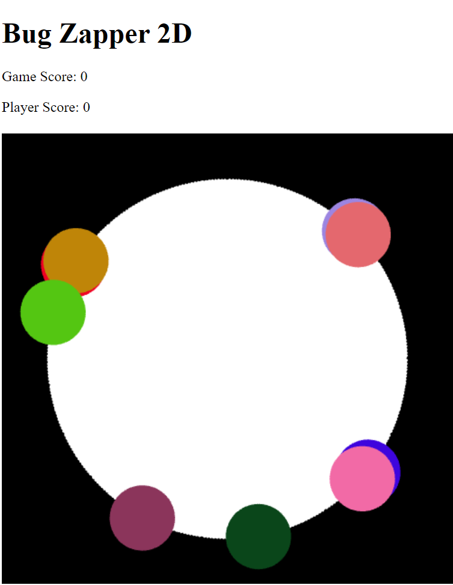

# BugZapper2D
## Description
Two-Dimensional Interactive Bug Zapper Game Developed Using WebGL and Javascript.

## How To Play
1. The player needs to eradicate the bacteria by placing the mouse over the bacteria and
hitting a button.

2. The effect of the poison administered is to immediately remove the poisoned bacteria.

3. The game gains points through the delays in the user responding and by any specific
bacteria reaching a threshold.

4. The player wins if all bacteria are poisoned before any two different bacteria reach the
threshold mentioned above.

## Demo
